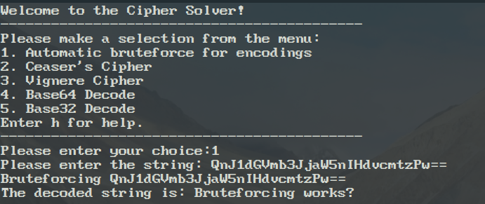
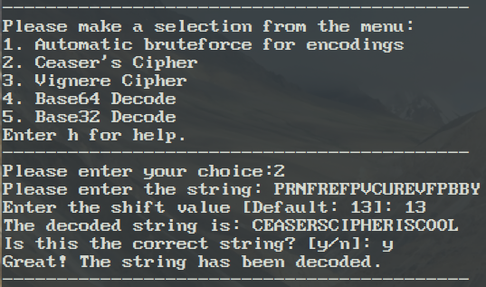
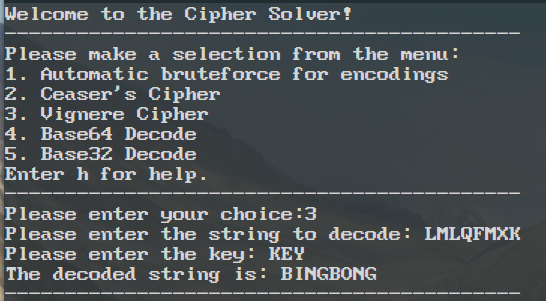
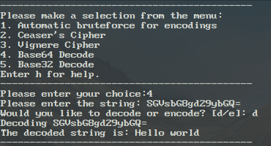
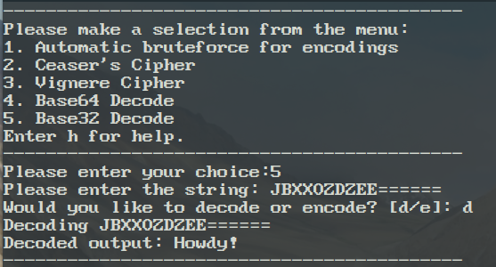

 Cipher Solver

 The Cipher Solver is a C program designed to help users explore
 various encryption and encoding techniques. The program provides a
 menu-driven interface to select different types of encodings and
 ciphers, allowing users to encode, decode, and brute-force a given
 input string. It includes support for common cryptographic and
 encoding methods like Base64, Base32, Caesar\'s Cipher, and Vigenère
 Cipher.

 **Sample Inputs and Outputs**

 **1.** **Automatic Bruteforce**\
 Input: QnJ1dGVmb3JjaW5nIHdvcmtzPw==

 

 **2.** **Caesar's Cipher**\
 Input: PRNFREFPVCUREVFPBBY

 **3.** **Vignere Cipher**\
 LMLQFMXK\
 Key: KEY

 

 **4.** **Base64**\
 Input: SGVsbG8gd29ybGQ=

 

 **5.** **Base32**\
 Input: JBXXOZDZEE======

 
